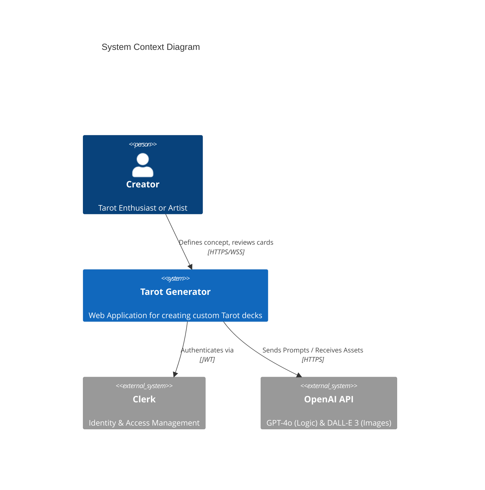
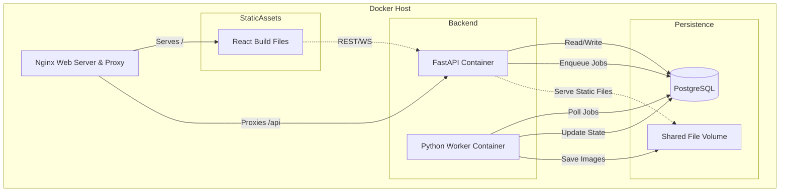
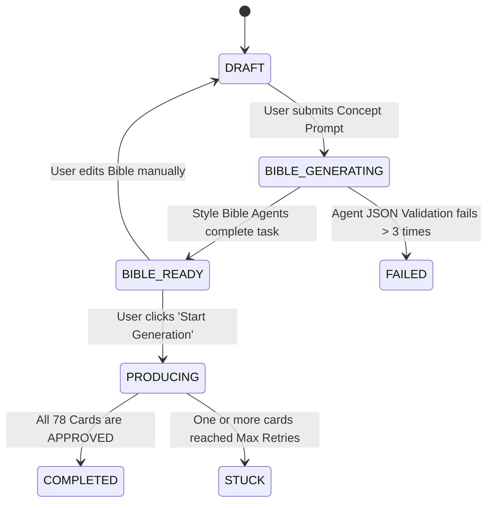
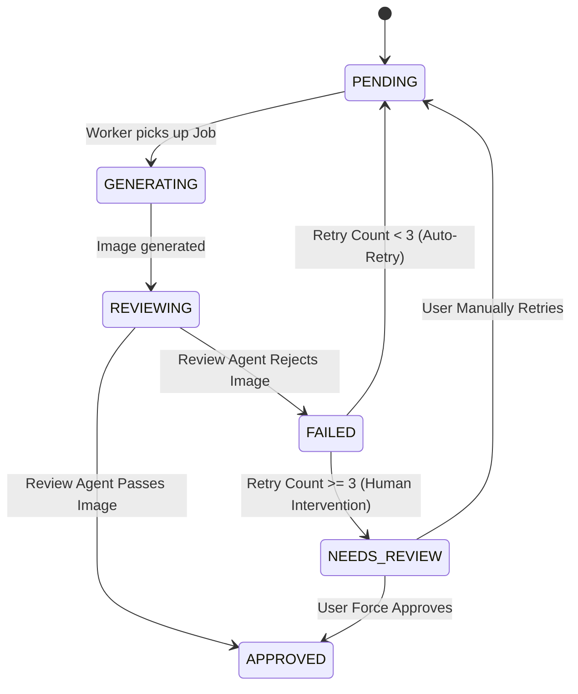

#  Technical Specification
## [TRD-1] Architectural Drivers & Constraints
### [TRD-2] Business Goals
[TRD-3] Scalable Creative Generation: The system must support the automated generation of complete 78-card Tarot decks. This moves beyond single-image generation to a cohesive product creation workflow where consistency is paramount. 

[TRD-4] Aesthetic Consistency: The core value proposition is the "Style Bible," ensuring that all 78 cards share the same visual language (medium, palette, lighting). The system must enforce this consistency through agentic review loops. 

[TRD-5] Print-Ready Output: The final artifact must be a high-resolution file package formatted for physical printing (Standard Tarot Size: 2.75" x 4.75" at 300 DPI). 

[TRD-6] Cost Efficiency: The system acts as a wrapper around expensive paid APIs (OpenAI). It must implement strict controls to prevent runaway costs due to infinite generation loops or agent hallucinations. 

### [TRD-7] Technical Constraints
[TRD-8] Asynchronous Processing: The generation of a full deck involves significant latency. 

[TRD-9]
```latex
T_{total} = T_{bible} + (N_{cards} \times T_{card})
```

[TRD-10] Where $T_{bible} \approx 60s$, $N_{cards} = 78$, and $T_{card} \approx 15s$. The architecture must be event-driven and non-blocking to handle total generation times exceeding 20 minutes. 

[TRD-11] Stateless API Layer: The web server (FastAPI) must remain stateless to allow for horizontal scaling and redundancy. All application state must be persisted in the PostgreSQL database or the File Storage system. 

[TRD-12] Resource Limits: The Worker process hosting CrewAI agents requires significant memory for context window management. 

[TRD-13]
```latex
M_{worker} \geq 1.5 \text{ GB}
```

[TRD-14] This constraint dictates the container resource limits in the deployment configuration. 

### [TRD-15] Quality Attributes
[TRD-16] Observability: Every action taken by an autonomous agent (thought process, tool usage, final output) must be logged to the database. This is critical for debugging "hallucinations" and tuning system prompts. 

[TRD-17] Resilience: The system must be able to recover from upstream API failures (e.g., OpenAI 503 errors) without data loss. Jobs in the queue must be retried with exponential backoff. 

[TRD-18] Debuggability: The system must be verifiable via Command Line Interface (CLI) scripts. A developer must be able to trigger, monitor, and debug a generation job without relying on the Frontend UI. 

## [TRD-19] System Context & Component Diagrams
### [TRD-20] High-Level System Context
The Tarot Generator functions as a creative studio, mediating between the End User and powerful AI models.

[TRD-21]


### [TRD-22] Container Architecture
The system adopts a decoupled frontend/backend architecture. The React SPA is built as static assets and served by Nginx, while the FastAPI backend handles logic and orchestration.

[TRD-23]


### [TRD-24] State Machine: Deck Lifecycle
The Deck entity manages the macro-state of the user's project.

[TRD-25]


### [TRD-26] State Machine: Card Lifecycle
Each Card (78 per deck) operates as an independent unit of work with its own quality control loop.

[TRD-27]


## [TRD-28] Data Layer Specification
### [TRD-29] Schema Design
The database schema utilizes PostgreSQL 16. It handles application data, agent logs, and the asynchronous task queue (procrastinate).

#### [TRD-30] Table: users
[TRD-31] id (UUID, Primary Key): Internal unique identifier. 

[TRD-32] auth_id (VARCHAR, Unique Index): The stable identifier provided by the Auth Provider (Clerk). 

[TRD-33] email (VARCHAR): User email for notifications. 

[TRD-34] created_at (TIMESTAMP): Record creation time. 

#### [TRD-35] Table: decks
[TRD-36] id (UUID, Primary Key): Unique Deck identifier. 

[TRD-37] user_id (UUID, Foreign Key): Links to users.id. Cascade Delete. 

[TRD-38] title (VARCHAR): User-defined project title. 

[TRD-39] concept_prompt (TEXT): The raw initial idea input by the user. 

[TRD-40] style_bible (JSONB): The structured configuration generated by the Style Crew. 

[TRD-41] status (ENUM): DRAFT, BIBLE_GENERATING, BIBLE_READY, PRODUCING, COMPLETED, PAUSED. 

[TRD-42] metadata (JSONB): Stores aggregate statistics (e.g., {"completed_cards": 12, "failed_cards": 0}). 

[TRD-43] created_at (TIMESTAMP): Record creation time. 

[TRD-44] updated_at (TIMESTAMP): Last modification time. 

#### [TRD-45] Table: cards
[TRD-46] id (UUID, Primary Key): Unique Card identifier. 

[TRD-47] deck_id (UUID, Foreign Key): Links to decks.id. Cascade Delete. 

[TRD-48] rank (INTEGER): Numerical rank (0-21 for Major Arcana, 1-14 for Minor Arcana). 

[TRD-49] suit (ENUM): MAJOR, WANDS, CUPS, SWORDS, PENTACLES. 

[TRD-50] name (VARCHAR): The canonical Tarot name (e.g., "The Fool", "Ten of Cups"). 

[TRD-51] status (ENUM): PENDING, GENERATING, APPROVED, REVIEW_FAILED, NEEDS_REVIEW. 

[TRD-52] image_path (VARCHAR, Nullable): Relative path to the stored image asset (e.g., /decks/{id}/{name}.png). 

[TRD-53] current_prompt (TEXT, Nullable): The exact prompt sent to DALL-E for the most recent generation. 

[TRD-54] retry_count (INTEGER): The number of failed generation attempts. Default 0. 

[TRD-55] review_history (JSONB): An array of strings containing the Review Agent's feedback from previous failures. 

[TRD-56] Constraint: Unique constraint on (deck_id, name) to prevent duplicate cards. 

#### [TRD-57] Table: procrastinate_jobs
-Managed by the procrastinate library.

[TRD-58] Stores task arguments, scheduling information, and execution state (todo, doing, succeeded, failed). 

#### [TRD-266] Table: system_budgets
Tracks monthly expenditure for API services.

[TRD-262] month_key (VARCHAR, PK): Format 'YYYY-MM' to identify the billing period. 

[TRD-265] total_spend_usd (NUMERIC): Atomic counter of cumulative spend. 

### [TRD-59] Data Models (Pydantic Schemas)
Strict validation schemas used for API contracts and JSON database fields.

#### [TRD-60] Model: StyleBible
[TRD-61] art_medium (String): The physical medium to simulate (e.g., "Watercolor on canvas", "3D Render"). 

[TRD-62] color_palette (List[String]): A list of 3-7 hex codes or color names defining the deck's look. 

[TRD-63] lighting_style (String): Description of lighting (e.g., "Cinematic, high contrast", "Soft, diffuse daylight"). 

[TRD-64] symbolism_rules (String): Instructions on how to adapt standard Tarot symbols (e.g., "Replace all swords with laser beams"). 

[TRD-65] tone_of_voice (String): The narrative voice for any text generation. 

#### [TRD-66] Model: CardStatusDTO
[TRD-67] id (UUID): Card ID. 

[TRD-68] name (String): Card Name. 

[TRD-69] status (String): Current enum status. 

[TRD-70] thumbnail_url (String, Optional): URL to the generated image if it exists. 

[TRD-71] last_error (String, Optional): The most recent critique if status is REVIEW_FAILED. 

### [TRD-72] File Storage Strategy
The system employs an abstraction layer for file storage to support MVP (Local) and Production (S3) deployments.

#### [TRD-73] Interface: StorageProvider
[TRD-74] save(data: bytes, path: str) -> str: Writes binary data to the specified path. Returns the relative path. 

[TRD-75] get_url(path: str) -> str: Returns a resolvable URL for the frontend. 

[TRD-76] delete(path: str) -> None: Removes the file. 

#### [TRD-77] Implementation: LocalStorageProvider
[TRD-78] Root Directory: /app/storage (Mapped to Docker Volume app_data). 

[TRD-79] Path Structure: /{user_id}/{deck_id}/{timestamp}_{sanitized_card_name}.png. 

[TRD-80] URL Resolution: The API mounts a static file handler at /static that maps to the storage root. 

## [TRD-81] Backend Service: API & Orchestration
### [TRD-82] Core Module
[TRD-83] Settings: Configuration loaded from environment variables using Pydantic BaseSettings. 

[TRD-84] Database: Async SQLAlchemy engine with connection pooling. 

[TRD-85] Logging: Structured JSON logging to stdout, capturing request_id, user_id, and path. 

### [TRD-86] Authentication Middleware
[TRD-87] Protocol: Bearer Token (JWT). 

[TRD-88] Validation: 

[TRD-89] The middleware intercepts every request to protected routes. 

[TRD-90] It validates the JWT signature using the Clerk public key (JWKS). 

[TRD-91] It checks the exp (Expiration) claim. 

[TRD-92] User Sync: 

[TRD-93] Upon successful validation, the middleware extracts the sub (Subject ID). 

[TRD-94] It checks the users table for this ID. 

[TRD-95] If the user does not exist, it creates a new record immediately (Just-In-Time Provisioning). 

[TRD-96] Context: The user object is injected into the request dependency graph (request.state.user). 

### [TRD-97] Domain: Deck Management
#### [TRD-98] Endpoint: Create Deck
[TRD-99] Route: POST /api/v1/decks 

[TRD-100] Input: DeckCreateRequest (concept_prompt string). 

[TRD-101] Logic: 

[TRD-102] Create a new Deck record linked to the current user. 

[TRD-103] Set status to DRAFT. 

[TRD-104] Enqueue the generate_style_bible task via procrastinate. 

[TRD-105] Update status to BIBLE_GENERATING. 

[TRD-106] Commit transaction. 

[TRD-107] Output: DeckDTO containing the new Deck ID. 

#### [TRD-108] Endpoint: Update Bible
[TRD-109] Route: PATCH /api/v1/decks/{id}/bible 

[TRD-110] Input: StyleBible JSON. 

[TRD-111] Logic: 

[TRD-112] Verify user owns the deck. 

[TRD-113] Validate the input JSON against StyleBibleSchema. 

[TRD-114] Update the style_bible column. 

[TRD-115] Side Effect: Broadcast a BIBLE_UPDATED event to all connected WebSockets for this deck. 

### [TRD-116] Domain: Card Production
#### [TRD-117] Endpoint: Start Production
[TRD-118] Route: POST /api/v1/decks/{id}/start 

[TRD-119] Logic: 

[TRD-120] Verify Deck status is BIBLE_READY or DRAFT (with valid bible). 

[TRD-121] Update Deck status to PRODUCING. 

[TRD-122] Perform a bulk database insert to create 78 Card records (if they don't exist). 

[TRD-123] Perform a bulk task deferral: Enqueue 78 generate_card_task jobs, one for each card. 

[TRD-124] Performance: This ensures the HTTP request completes quickly, offloading the massive work to the queue. 

#### [TRD-125] Endpoint: Retry Card
[TRD-126] Route: POST /api/v1/cards/{id}/retry 

[TRD-127] Logic: 

[TRD-128] Verify user owns the card. 

[TRD-129] Reset retry_count to 0. 

[TRD-130] Update status to PENDING. 

[TRD-131] Enqueue a new generate_card_task for this specific card. 

[TRD-132] Broadcast CARD_UPDATE event. 

### [TRD-133] Real-Time Subsystem
#### [TRD-134] WebSocket Manager
[TRD-135] Route: /ws/decks/{deck_id} 

[TRD-136] Authentication: 

[TRD-137] Clients must pass the JWT token as a query parameter: ?token=.... 

[TRD-138] The connection is rejected if the token is invalid or the user does not own the deck. 

[TRD-139] Connection Tracking: 

[TRD-140] The manager maintains a map: active_connections: Dict[UUID, List[WebSocket]]. 

[TRD-141] Event Broadcasting: 

[TRD-142] Internal Webhook: The Worker service cannot access the WebSocket objects directly. 

[TRD-143] Instead, the Worker calls an internal API endpoint: POST /internal/notify. 

[TRD-144] The API receives this request and uses the WebSocket Manager to push the message to the relevant clients. 

## [TRD-145] Worker Service: Agent Logic & Execution
### [TRD-146] Orchestration Infrastructure
[TRD-147] Framework: procrastinate worker running in a dedicated Python process. 

[TRD-148] Concurrency: Configured to run N tasks in parallel. 

[TRD-149]
```latex
N_{tasks} = \min(10, \frac{\text{OpenAI Rate Limit (TPM)}}{\text{Avg Tokens per Task}})
```

[TRD-150] Error Handling: 

[TRD-151] Global exception handler catches crashes. 

[TRD-152] If a task fails, it is retried with exponential backoff (up to 3 times) by the queue system before being marked as failed in the job table. 

### [TRD-153] Domain: Style Bible Generation
#### [TRD-154] Task:
[TRD-155] Inputs: deck_id, concept_prompt. 

[TRD-156] Agents: 

[TRD-157] Lead Writer: Specialized in narrative tone. 

[TRD-158] Art Director: Specialized in visual description. 

[TRD-159] Symbolist: Specialized in Tarot iconography. 

[TRD-160] Flow: 

[TRD-161] The agents collaborate sequentially to define the Style Bible fields. 

[TRD-162] The output is forced into the StyleBible Pydantic model. 

[TRD-163] Validation: If the LLM output cannot be parsed into the schema, the task fails (triggering a retry). 

[TRD-164] Output: The validated JSON is written to decks.style_bible and the status is updated to BIBLE_READY. 

### [TRD-165] Domain: Card Production (The Loop)
#### [TRD-166] Task:
[TRD-167] Inputs: card_id, deck_context. 

[TRD-168] Agents: 

[TRD-169] Concept Agent: "How does [Card Name] look in [Style]?" 

[TRD-170] Prompt Agent: "Write a DALL-E 3 prompt for [Concept]." 

[TRD-171] Review Agent: "Does [Image] match [Style] and [Card Name]? Answer YES/NO." 

[TRD-172] Execution Loop: 

[TRD-173] This task implements an internal loop to handle creative refinement. 

[TRD-174]
```python
retries = 0
while retries < 3:
    prompt = prompt_agent.run()
    image_path = image_tool.run(prompt)
    critique = review_agent.run(image_path)

    if critique.passed:
        save_card_as_approved(card_id, image_path)
        return

    record_failure(card_id, critique.feedback)
    retries += 1

mark_card_needs_review(card_id)
```

Budget error handling in loop
try:
image_path = image_tool.run(prompt)
except BudgetExceededError:
mark_deck_paused_budget(deck_id)
return

[TRD-175] Tools: 

[TRD-176] ImageGenTool: Calls DALL-E 3 API, saves result to StorageProvider, returns file path. 

[TRD-177] The ImageGenTool must enforce a Global Monthly Hard Cap by querying the current cumulative DALL-E 3 expenditure before each API call. If the budget limit is reached, it must raise a BudgetExceededError to halt generation and prevent further billing. 

[TRD-263] The system must track the current month's cumulative spend in USD by multiplying successful DALL-E 3 API calls by the current per-image price model ($0.040 for Standard 1024x1024). 

## [TRD-178] Frontend Application
### [TRD-179] Architecture
[TRD-180] Framework: React 18 using Vite for the Single Page Application (SPA) build pipeline. 

[TRD-269] Routing: Client-side routing managed by react-router-dom. 

[TRD-181] Styling: Tailwind CSS + ShadCN UI components. 

[TRD-182] Data Fetching: Redux Toolkit Query (RTK Query) for server state synchronization and caching. 

### [TRD-183] State Management
[TRD-184] Store: Redux Store (Redux Toolkit) with dedicated slices for decks and cards. 

[TRD-185] Responsibility: 

[TRD-186] The deckSlice manages the current active Deck object and its creative metadata. 

[TRD-187] The cardSlice manages the normalized collection of 78 Card objects and their individual generation states. 

[TRD-188] WebSocket Integration: The WebSocket client dispatches Redux actions (e.g., cardUpdated) upon receiving CARD_UPDATE events. The store updates state immutably, triggering selective re-renders of the associated UI components. 

### [TRD-189] Component: Bible Editor
[TRD-190] Type: Form-based Editor. 

[TRD-191] Inputs: StyleBible object. 

[TRD-192] Validation: Client-side Zod schema matching the backend Pydantic model. 

[TRD-193] Interaction: 

[TRD-194] Users can tweak the "Color Palette" using a visual color picker. 

[TRD-195] Users can rewrite the "Tone of Voice" text. 

[TRD-196] Save: Explicit save button triggers PATCH /api/decks/{id}/bible. 

### [TRD-197] Component: Card Grid
[TRD-198] Layout: CSS Grid with responsive columns. 

[TRD-199] Performance: 

[TRD-200] Uses react-virtuoso or similar virtualization if DOM node count impacts performance. 

[TRD-201] Lazy Loading: Card images utilize loading="lazy" attributes. 

[TRD-202] Card Tile States: 

[TRD-203] Loading: Skeleton pulse animation. 

[TRD-204] Generating: Blue border with spinner. 

[TRD-205] Approved: Display image. 

[TRD-206] Failed: Red border with "Retry" button overlay. 

### [TRD-207] Component: Export Manager
[TRD-208] Trigger: "Download PDF" button. 

[TRD-209] Flow: 

[TRD-271] The frontend initiates a request for export via the Backend API. 

[TRD-270] The Backend enqueues the export_pdf_task and returns a job ID. 

[TRD-268] The React application monitors the job status via WebSocket notifications or periodic polling. 

[TRD-267] Upon task completion, the frontend triggers a browser download using the provided static resource link. 

## [TRD-214] Verification & Quality Assurance
### [TRD-215] Developer Tooling (CLI)
Since the full UI loop is slow, developers use CLI scripts for verification.

[TRD-216] Script: scripts/seed_state.py 

[TRD-217] Usage: python scripts/seed_state.py --scenario stuck_card 

[TRD-218] Effect: Wipes the DB and inserts a Deck with 1 card in NEEDS_REVIEW state. 

[TRD-219] Purpose: Allows frontend devs to style the error state without waiting for AI failure. 

[TRD-220] Script: scripts/lab_agent.py 

[TRD-221] Usage: python scripts/lab_agent.py --agent style --prompt "Cyberpunk" 

[TRD-222] Effect: Runs the Style Crew in isolation and prints the JSON output. 

[TRD-223] Purpose: Prompt engineering and tuning the "Temperature" of the LLM. 

[TRD-224] Script: scripts/trace_job.py 

[TRD-225] Usage: python scripts/trace_job.py --job-id <uuid> 

[TRD-226] Effect: Tails the logs for a specific background task. 

[TRD-227] Purpose: Debugging why a card generation is stuck. 

### [TRD-228] QA Procedures
[TRD-229] Smoke Test: 

[TRD-230] Create a Deck. 

[TRD-231] Generate a Bible (verify JSON schema). 

[TRD-232] Generate 1 Card (verify image exists on disk). 

[TRD-233] Resilience Test: 

[TRD-234] Start a generation job. 

[TRD-235] Kill the Docker Worker container (docker stop tarot-worker). 

[TRD-236] Restart the container. 

[TRD-237] Verification: The job should be picked up by Procrastinate and resumed or retried. 

## [TRD-238] Deployment Requirements
### [TRD-239] Infrastructure
[TRD-240] Container Runtime: Docker Engine. 

[TRD-241] Orchestrator: Docker Compose (for single-node deployment). 

[TRD-242] Web Server & Reverse Proxy: Nginx to serve the static React production build and proxy API/WebSocket requests to the FastAPI backend. 

### [TRD-243] Environment Configuration
[TRD-244] Secrets Management: All secrets injected via .env file, never hardcoded. 

[TRD-245] OPENAI_API_KEY: Critical. 

[TRD-246] POSTGRES_PASSWORD: Critical. 

[TRD-247] CLERK_SECRET_KEY: Critical. 

[TRD-264] MAX_MONTHLY_BUDGET_USD: Defines the maximum allowed spend across all users per month (e.g., '100.00'). 

[TRD-248] Feature Flags: 

[TRD-249] MOCK_DALLE: If true, the ImageGenTool returns a static placeholder image. This prevents accidental billing during development and testing. 

### [TRD-250] Database Migrations
[TRD-251] Tool: Alembic. 

[TRD-252] Workflow: 

[TRD-253] Developers create migration scripts locally (alembic revision --autogenerate). 

[TRD-254] The production container runs alembic upgrade head in the entrypoint script before starting the application. 

### [TRD-255] Resource Limits
[TRD-256] Worker Container: 

[TRD-257] CPU: 1.0 vCPU minimum. 

[TRD-258] Memory: 2GB RAM (to handle image processing and CrewAI overhead). 

#### [TRD-259] Container: Backend API
[TRD-260] CPU: 0.5 vCPU. 

[TRD-261] Memory: 512MB RAM. 
